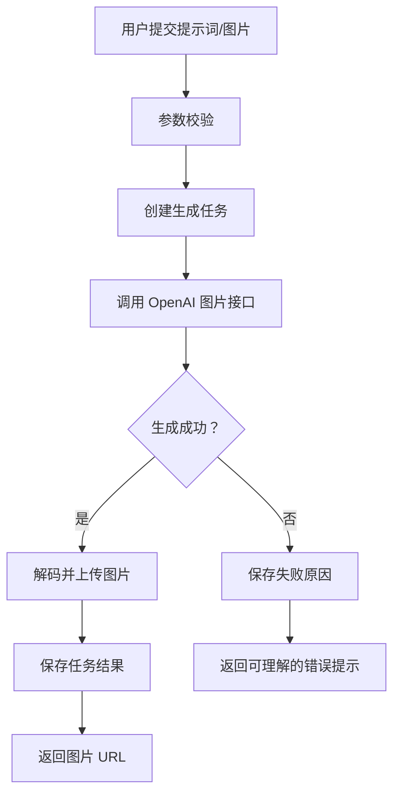

# GPT Image 发布与接入文档

更新日期：2026-05-27

## 1. 文档目标

本文档用于说明 GPT Image 相关能力的产品发布、技术接入、参数配置、质量验收与上线检查。适用于需要在应用中提供图片生成、图片编辑、多轮改图、参考图改造、透明背景图、商品图、海报图、头像图等能力的团队。

## 2. 能力概览

OpenAI API 当前支持通过文本提示词生成图片，也支持基于输入图片进行编辑。图像能力主要有两种接入路径：

| 接入方式 | 适用场景 | 特点 |
| --- | --- | --- |
| Images API | 单次生成或单次编辑图片 | 接口直接，适合图片工具、批量生成、固定工作流 |
| Responses API + `image_generation` 工具 | 对话式生成、多轮改图、Agent 流程 | 支持把图片输入、图片输出和上下文放在同一轮或多轮会话中 |

官方建议：如果只是从一个提示词生成或编辑一张图片，优先使用 Images API；如果要做可对话、可连续修改的图片体验，优先使用 Responses API。

## 3. 模型选择

| 模型 | 推荐用途 | 说明 |
| --- | --- | --- |
| `gpt-image-2` | 默认推荐 | 当前 GPT Image 系列的主力模型，适合高质量生成和编辑，支持更灵活的尺寸 |
| `gpt-image-1.5` | 兼容已有高质量图片链路 | 前代高质量模型，可用于已有系统平滑过渡 |
| `gpt-image-1-mini` | 成本优先 | 适合对质量要求较低、吞吐或成本更敏感的场景 |
| `dall-e-2` / `dall-e-3` | 旧项目兼容 | 适合维护存量链路，新项目建议优先选择 GPT Image 系列 |

注意：使用 GPT Image 模型前，组织可能需要完成 API Organization Verification。

## 4. 推荐发布范围

首版建议发布以下能力：

1. 文生图：用户输入描述，生成一张或多张图片。
2. 图生图/图片编辑：用户上传参考图，按提示词修改局部或整体风格。
3. 多轮改图：用户可以在上一张图基础上继续提出修改意见。
4. 输出格式控制：支持 `png`、`webp`、`jpeg`。
5. 尺寸与质量控制：支持方图、竖图、横图和自动尺寸；支持低、中、高质量。
6. 安全过滤：对提示词和生成结果进行内容安全处理。

## 5. 接入方案

### 5.1 Images API：单次图片生成

适合「输入提示词，返回图片」的简单流程。

```python
from openai import OpenAI
import base64

client = OpenAI()

result = client.images.generate(
    model="gpt-image-2",
    prompt="生成一张极简风格的咖啡品牌海报，白色背景，主体是一杯拿铁，带有柔和自然光",
    size="1024x1024",
    quality="medium",
    output_format="png",
)

image_base64 = result.data[0].b64_json

with open("output.png", "wb") as f:
    f.write(base64.b64decode(image_base64))
```

### 5.2 Images API：图片编辑

适合「上传图片后按提示词修改」的流程。

```python
from openai import OpenAI
import base64

client = OpenAI()

result = client.images.edit(
    model="gpt-image-2",
    image=open("input.png", "rb"),
    prompt="保持人物姿态不变，把背景改成干净的浅灰色摄影棚，并增强商品质感",
    size="1024x1024",
    quality="high",
    output_format="png",
)

image_base64 = result.data[0].b64_json

with open("edited.png", "wb") as f:
    f.write(base64.b64decode(image_base64))
```

### 5.3 Responses API：对话式图片生成

适合「边聊边生成、连续改图、Agent 编排」。

```python
from openai import OpenAI
import base64

client = OpenAI()

response = client.responses.create(
    model="gpt-5",
    input="为一个新茶饮品牌生成一张社交媒体首图，画面包含柠檬茶、冰块和清爽夏日氛围",
    tools=[
        {
            "type": "image_generation",
            "size": "1024x1024",
            "quality": "medium",
            "output_format": "png"
        }
    ],
)

image_data = [
    item.result
    for item in response.output
    if item.type == "image_generation_call"
]

if image_data:
    with open("social-cover.png", "wb") as f:
        f.write(base64.b64decode(image_data[0]))
```

### 5.4 多轮改图

Responses API 可以通过 `previous_response_id` 或图片 ID 继续编辑前一轮图片。适合以下场景：

- 用户希望「把背景再亮一点」
- 用户希望「保留主体，只换成冬季主题」
- 用户希望「把文案换成中文」
- 用户希望「生成 3 个更高级的版本」

推荐产品交互：

1. 第一轮生成图片。
2. 保存 response ID 或 image ID。
3. 后续用户输入修改意见。
4. 使用上一轮上下文继续调用 Responses API。

## 6. 关键参数

| 参数 | 说明 | 常用值 |
| --- | --- | --- |
| `model` | 图片模型或主模型 | Images API 使用 `gpt-image-2`；Responses API 使用支持工具调用的文本模型 |
| `prompt` / `input` | 用户提示词 | 描述主体、风格、构图、用途、限制 |
| `size` | 图片尺寸 | `1024x1024`、`1024x1536`、`1536x1024`、`auto`；`gpt-image-2` 支持更灵活尺寸 |
| `quality` | 质量等级 | `low`、`medium`、`high`、`auto` |
| `output_format` | 输出格式 | `png`、`webp`、`jpeg` |
| `background` | 背景 | `transparent`、`opaque`、`auto`；注意 `gpt-image-2` 当前不支持透明背景 |
| `n` | 返回图片数量 | 默认为 1，可按场景提高 |
| `moderation` | 安全过滤强度 | 根据产品合规策略配置 |
| `action` | Responses API 图片工具行为 | `auto`、`generate`、`edit` |

## 7. 提示词规范

建议提示词包含以下信息：

| 维度 | 示例 |
| --- | --- |
| 主体 | 一杯冰美式、一双白色运动鞋、一个科技感 App 图标 |
| 用途 | 电商主图、社交媒体封面、品牌海报、头像 |
| 风格 | 极简、写实摄影、3D 渲染、扁平插画、电影感 |
| 构图 | 居中构图、俯拍、半身像、留白区域在右侧 |
| 光线 | 自然光、柔光棚拍、黄昏逆光、高对比 |
| 背景 | 纯白背景、浅灰摄影棚、城市街景、透明背景 |
| 限制 | 不要文字、不要水印、不要多余人物、保持原商品形状 |

推荐写法：

```text
生成一张电商主图：主体是一只白色无线耳机，居中构图，纯白背景，柔和棚拍光线，产品边缘清晰，有轻微地面阴影，整体高级、干净。不要文字，不要水印，不要出现手。
```

图片编辑推荐写法：

```text
编辑这张图片：保留商品本身的形状、颜色和角度，只把背景替换成浅灰色摄影棚，增加柔和阴影，让图片更适合电商详情页。
```

## 8. 输出与存储

GPT Image 模型默认返回 base64 图片数据。业务侧建议：

1. 服务端解码 base64 并存储到对象存储。
2. 保存生成任务 ID、用户 ID、提示词、模型、尺寸、质量、格式、成本信息。
3. 前端只展示图片 URL，不直接长期保存 base64。
4. 对失败任务保存错误原因，便于重试和客服排查。

建议保存字段：

| 字段 | 说明 |
| --- | --- |
| `task_id` | 业务生成任务 ID |
| `user_id` | 用户 ID |
| `model` | 使用模型 |
| `prompt` | 原始提示词 |
| `revised_prompt` | 模型优化后的提示词，Responses API 工具调用中可读取 |
| `size` | 图片尺寸 |
| `quality` | 质量等级 |
| `output_format` | 图片格式 |
| `image_url` | 业务侧存储地址 |
| `usage` | token 或图片生成用量 |
| `status` | pending / success / failed |

## 9. 安全与合规

上线前需要处理以下安全事项：

1. 对用户输入提示词进行基础校验，拦截明显违规内容。
2. 接入 OpenAI 的内容安全过滤结果。
3. 对生成失败、被拒绝、超时等情况提供清晰提示。
4. 对用户上传图片限制格式、大小和数量。
5. 对公开分享、商用下载等场景增加审核策略。
6. 不在日志中保存敏感个人信息。
7. 明确用户协议中关于 AI 生成内容的使用边界。

## 10. 成本与性能

影响成本和延迟的主要因素：

1. 模型：`gpt-image-2` 质量更高，成本需按官方价格页实时核算。
2. 图片尺寸：更大尺寸通常会带来更高生成成本和延迟。
3. 质量等级：`high` 比 `medium`、`low` 更适合最终成片，但更慢也更贵。
4. 输入图片数量：编辑和参考图会增加输入 token 或处理成本。
5. 并发数量：需要结合组织 rate limit 设置队列和重试策略。

建议默认配置：

| 场景 | 推荐配置 |
| --- | --- |
| 草稿预览 | `quality="low"` 或 `medium` |
| 普通用户生成 | `quality="medium"` |
| 付费高清下载 | `quality="high"` |
| 社交封面 | `1024x1024` 或 `1536x1024` |
| 海报/竖图 | `1024x1536` |
| 商品主图 | `1024x1024` |

## 11. 前端交互建议

核心页面建议包含：

1. 提示词输入框。
2. 图片上传区，可选。
3. 风格、尺寸、质量、格式选择。
4. 生成按钮与生成中状态。
5. 结果图预览、下载、继续编辑、重新生成。
6. 历史记录与失败重试。

状态文案建议：

| 状态 | 文案 |
| --- | --- |
| 等待输入 | 描述你想生成的图片 |
| 生成中 | 图片生成中，请稍候 |
| 成功 | 已生成图片 |
| 失败 | 生成失败，请调整描述后重试 |
| 安全拦截 | 该内容暂不支持生成 |

## 12. 后端流程



## 13. 上线检查清单

### 产品检查

- [ ] 文生图流程可用。
- [ ] 图生图/编辑流程可用。
- [ ] 生成中、成功、失败状态完整。
- [ ] 支持下载或保存图片。
- [ ] 支持重新生成或继续编辑。
- [ ] 用户可理解安全拦截与失败原因。

### 技术检查

- [ ] API Key 使用服务端环境变量管理。
- [ ] 上传图片有格式和大小限制。
- [ ] 生成任务有超时与重试机制。
- [ ] 图片结果已落地到业务存储。
- [ ] 日志不泄露用户敏感信息。
- [ ] 已记录模型、参数、用量和错误信息。
- [ ] 已根据 rate limit 设置队列或限流。

### 合规检查

- [ ] 接入内容安全策略。
- [ ] 用户协议覆盖 AI 生成内容。
- [ ] 对公开内容或商用素材有审核方案。
- [ ] 对未成年人、肖像、品牌和版权相关场景有明确限制。

## 14. 常见问题

### Q1：Images API 和 Responses API 应该选哪个？

单次图片生成或编辑用 Images API；需要对话式、多轮编辑、Agent 编排时用 Responses API。

### Q2：图片结果是 URL 还是 base64？

GPT Image 模型通常返回 base64 图片数据，业务侧需要解码并自行存储。旧 DALL·E 模型在特定参数下可能返回 URL，但不建议新项目依赖旧模型。

### Q3：透明背景怎么做？

可使用 `background="transparent"`，但要确认所选模型支持。`gpt-image-2` 当前不支持透明背景，传入透明背景会失败。

### Q4：为什么生成结果和用户原始提示词不完全一样？

使用 Responses API 的图片工具时，主模型可能会自动优化提示词。可以读取 `revised_prompt` 字段用于调试和展示。

### Q5：如何降低成本？

默认使用 `medium` 或 `low` 质量，限制尺寸和生成张数；仅在用户确认下载高清图时使用 `high` 质量。

## 15. 参考资料

- [OpenAI Image generation guide](https://developers.openai.com/api/docs/guides/image-generation)
- [OpenAI Image generation tool guide](https://developers.openai.com/api/docs/guides/tools-image-generation)
- [OpenAI Images API reference](https://developers.openai.com/api/reference/resources/images)
- [GPT Image 2 model page](https://developers.openai.com/api/docs/models/gpt-image-2)
- [OpenAI Models overview](https://developers.openai.com/api/docs/models)
